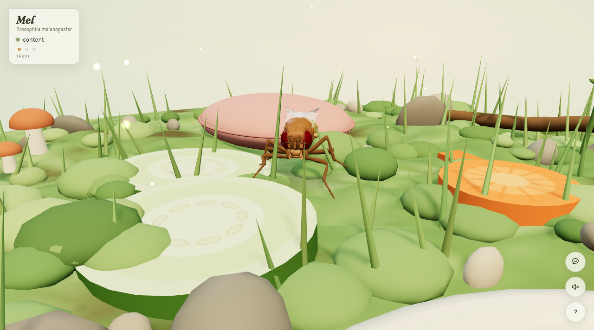

# Fly Paradise 🪰

A little browser terrarium for one fruit fly — **Mel** (*Drosophila melanogaster*).


Mel's body is the real thing: the [NeuroMechFly v2](https://github.com/NeLy-EPFL/flygym)
articulated body model (Apache-2.0), built from a micro-CT scan of an adult female fly,
decimated and baked into ~250 KB of quantized geometry. He walks on a procedural
tripod gait with per-leg IK, grooms his face with his front legs, sips from the water
dish, snacks on cucumber, and naps on a little pillow.

He is also shy. Your cursor has real presence in his world — move fast near him and
he bolts; approach slowly, stroke him gently, and trust grows. Once he trusts you,
he'll ride on your hand and sometimes walk over just to investigate you.

| He likes being petted | The neural view |
| --- | --- |
|  |  |

Press **N** for the neural view — a stylized homage to the
[FlyWire connectome](https://flywire.ai) (139,255 neurons, released 2024), whose
regions light up with whatever Mel is doing: mechanosensory circuits when you pet
him, wing motor + haltere gyroscopes at ~200 wingbeats/s when he flies, the sleep
switch when he's out cold on the pillow.



No build step, no framework — three.js r147 as plain script tags. The whole thing
is ~60 draw calls and runs at 60 fps on a phone.

## Run it

Open `index.html` in a browser, or:

```sh
python3 -m http.server 8000    # then http://localhost:8000
```

## Controls

- **Look around** — drag the empty air, arrow keys, scroll to zoom
- **Say hello** — bring the cursor near him *slowly*; sudden movement reads as a swat
- **Pet him** — hover close and stroke in slow, small circles
- **Pick him up** — once he trusts you, press and hold on him, then carry him gently
- **Feed him** — drag the cucumber or carrot; when he's peckish he'll find it
- **N** — neural view · **?** — field guide in the corner

## Single-file build (for hosting)

```sh
python3 tools/build.py         # -> dist/fly_paradise.html (~1 MB, self-contained)
```

Deploying is one file — `scp dist/fly_paradise.html your-server:…` and you're done.
(With gzip enabled it goes over the wire at ~300 KB.)

## Layout

```
index.html            page, HUD, styles
js/world.js           terrarium: terrain, dish, flowers, food, pillow, glass
js/fly.js             Mel: model rig, gait IK, behavior state machine, moods
js/brain.js           connectome hologram (neural view)
js/interact.js        cursor presence, gentleness, petting, carrying, food drag
js/main.js            boot, camera, lights, HUD wiring, sound, loop
js/flymodel.data.js   baked NeuroMechFly geometry (generated — do not edit)
vendor/               three.min.js + OrbitControls (r147, last global builds)
tools/bake_fly.py     regenerates flymodel.data.js from flygym assets
tools/build.py        inlines everything into dist/fly_paradise.html
tools/shot.sh         headless screenshot helper for visual checks
```

## Regenerating the fly model

```sh
# fetch flygym's simplified meshes + legacy MJCF into a work dir (see tools/bake_fly.py
# docstring for the expected layout), then:
python3 -m venv venv && venv/bin/pip install numpy trimesh fast-simplification
venv/bin/python tools/bake_fly.py <work_dir> js/flymodel.data.js
```

## Debug URL params

`?fast=1` speeds up hunger/thirst/sleep · `?neural=1` starts in neural view ·
`?state=groom|fly|nap|eat|drink` forces a behavior · `?cam=front|close|top|fly|neural|meltop`
camera presets · `?freeze=1` holds him still · `?wings=1&flap=0` wing pose debug ·
`?pet=1` simulates petting · `?shot=1` hides the intro hint.

## Credits

- Body model: [NeLy-EPFL/flygym](https://github.com/NeLy-EPFL/flygym) (NeuroMechFly v2),
  Apache-2.0 — a micro-CT scan of a real adult female *Drosophila*. See `vendor/FLYGYM_LICENSE`.
- Neural view inspired by the [FlyWire](https://flywire.ai) whole-brain connectome.
  The hologram is stylized, not the real wiring diagram.
- three.js r147, MIT.

No flies were swatted.
