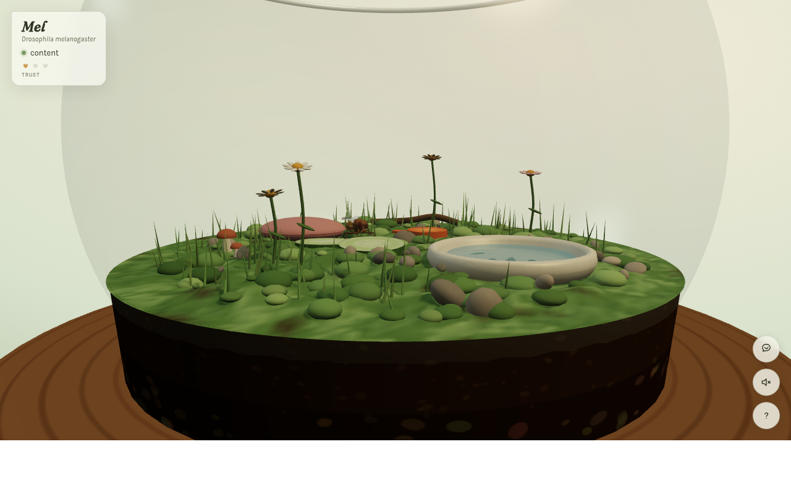
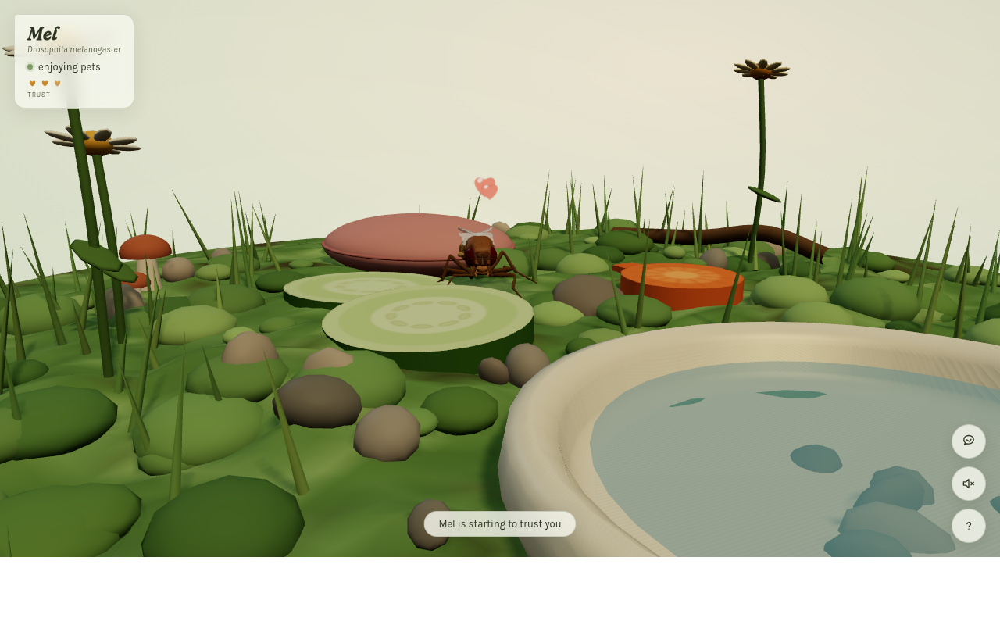
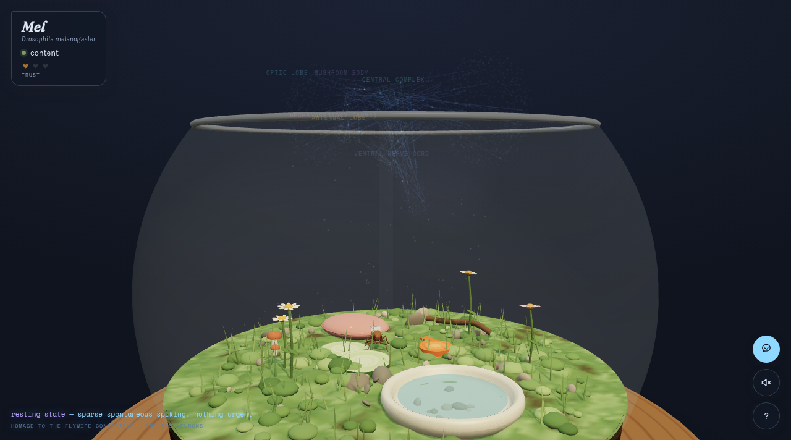

# Fly Paradise 🪰

A little browser terrarium for one fruit fly — **Mel** (*Drosophila melanogaster*) — built for static hosting with WebGPU.



Mel's body is the [NeuroMechFly v2](https://github.com/NeLy-EPFL/flygym) articulated body model (Apache-2.0), built from a micro-CT scan of an adult female fly and baked into compact quantized geometry. The original cozy terrarium, procedural tripod gait, leg IK, grooming, drinking, eating, sleeping, trust, petting, and carrying interactions are preserved.

| He likes being petted | The neural view |
| --- | --- |
|  |  |

Press **N** for the FlyWire view. It now draws all **139,255 proofread neuron representative locations** from the public [FlyWire Codex FAFB v783 dataset](https://codex.flywire.ai/api/download?dataset=fafb), plus the 20,830 measured connections with at least 100 synapses. Every connection with at least five synapses contributes to the region-to-region activity model.

This is faithful at the dataset/graph level, but intentionally not a full scientific simulator: the static site does not ship multi-gigabyte neuron skeletons, and its animated activity is a connectome-constrained behavioral visualization—not recorded firing data or a biological whole-brain emulation. The implementation follows the published [FlyWire whole-brain connectome](https://www.nature.com/articles/s41586-024-07558-y) while retaining the original hologram aesthetic.

The projection from Mel is a real 3D cone aligned from his current head position to the brain, so it remains attached while he moves and while the camera changes depth.

## Run it

ES modules require HTTP rather than opening `index.html` directly:

```sh
python3 -m http.server 8000
# then open http://localhost:8000
```

Three.js r185 uses `WebGPURenderer`; browsers without WebGPU use its WebGL 2 fallback. No server code or runtime data download is required.

## Controls

- **Look around** — drag the empty air, arrow keys, scroll to zoom
- **Say hello** — bring the cursor near him slowly; sudden movement reads as a swat
- **Pet him** — hover close and stroke in slow, small circles (on a phone: stroke beside him with a fingertip)
- **Pick him up** — once he trusts you, press and hold on him, then carry him gently
- **Feed him** — drag the cucumber or carrot; when he's peckish he'll find it
- **N** — neural view · **?** — field guide

## GitHub Pages

The repository root is already a deployable static site. In the repository's Pages settings, choose **Deploy from a branch**, select the desired branch, and use `/ (root)` as the folder.

To make a clean deployment directory for another static host:

```sh
python3 tools/build.py
# deploy dist/; its entry point is dist/index.html
```

## Regenerating the FlyWire overview

The checked-in `js/brain.data.js` is a compact, deterministic derivative of pinned public Codex v783 exports. Published FlyWire data is [CC BY-NC 4.0](https://edit.flywire.ai/principles.html), so the connectome-derived layer is non-commercial and requires attribution; see `vendor/FLYWIRE_DATA_LICENSE.md`. Rebuild it with:

```sh
python3 tools/fetch_brain.py data/flywire-v783
python3 tools/bake_brain.py data/flywire-v783 js/brain.data.js
```

The download helper verifies SHA-256 checksums. Raw downloads are about 77 MB and are not needed by the deployed site.

## Layout

```text
index.html                  page, HUD, styles, import map
js/app.js                   ES-module loader and Three.js bridge
js/world.js                 terrain, dish, flowers, food, pillow, glass
js/fly.js                   model rig, gait IK, behavior state machine, moods
js/brain.js                 FlyWire hologram and graph-based activity
js/brain.data.js            generated FAFB v783 overview data
js/interact.js              cursor presence, petting, carrying, food drag
js/main.js                  WebGPU renderer, camera, lights, HUD, loop
js/flymodel.data.js         generated NeuroMechFly geometry
vendor/                     pinned Three.js modules and licenses
tools/bake_fly.py           rebuilds the NeuroMechFly geometry
tools/fetch_brain.py        downloads and verifies Codex v783 source CSVs
tools/bake_brain.py         rebuilds the compact neural data
tools/build.py              assembles the static dist/ tree
tools/shot.sh               HTTP-based headless visual check
```

## Regenerating the fly model

```sh
# Fetch flygym's simplified meshes + legacy MJCF into a work directory, then:
python3 -m venv venv
venv/bin/pip install numpy trimesh fast-simplification
venv/bin/python tools/bake_fly.py <work_dir> js/flymodel.data.js
```

## Debug URL parameters

`?fast=1` speeds up hunger/thirst/sleep · `?neural=1` starts in neural view · `?state=groom|fly|nap|eat|drink` forces a behavior · `?cam=front|close|top|fly|neural|meltop` selects a camera preset · `?freeze=1` holds Mel still · `?wings=1&flap=0` debugs wing poses · `?pet=1` simulates petting · `?shot=1` hides the intro hint · `?webgl=1` forces the WebGL 2 fallback renderer.

## Credits

- Body model: [NeLy-EPFL/flygym](https://github.com/NeLy-EPFL/flygym) (NeuroMechFly v2), Apache-2.0. See `vendor/FLYGYM_LICENSE`.
- Connectome data: [FlyWire Codex FAFB v783](https://codex.flywire.ai/api/download?dataset=fafb); see the [FlyWire publication](https://www.nature.com/articles/s41586-024-07558-y).
- Renderer: Three.js r185, MIT. See `vendor/THREE_LICENSE`.

No flies were swatted.
